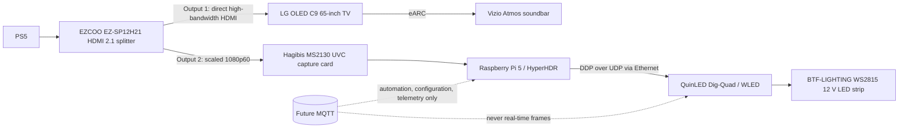

# Architecture

## Data-flow boundaries

The splitter's first output is the high-bandwidth PS5-to-TV path. Aurora does
not sit inline after that output and must not compromise 4K120, VRR, HDR, eARC,
or Atmos. Only the secondary, scaled 1080p60 output is captured.

HyperHDR on the Raspberry Pi 5 is the initial capture and screen-color
extraction component. The Pi and Dig-Quad communicate over Ethernet. WLED owns
physical LED control; Project Aurora does not replace either component in this
milestone.

## Transport roles

DDP over UDP is the planned real-time frame transport because it is intended
for frequent LED-frame delivery with low overhead. MQTT is deliberately
reserved for future automation, configuration, and telemetry. MQTT must not
transport real-time LED frames.

## Future zones

The first planned zone is the rear perimeter of the 65-inch LG C9. Future
independent zones should be represented as separately named, configurable
entities with their own mapping and endpoint configuration. LED counts,
addresses, ports, and layout orientation must be measured and configured, never
embedded in code or example defaults.
