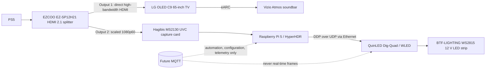

# Architecture

## Data-flow boundaries

The splitter's first output is the high-bandwidth PS5-to-TV path. Aurora does
not sit inline after that output and must not compromise 4K120, VRR, HDR, eARC,
or Atmos. Only the secondary, scaled 1080p60 output is captured.

HyperHDR on the Raspberry Pi 5 is the initial capture and screen-color
extraction component. The Pi and Dig-Quad communicate over Ethernet. WLED owns
physical LED control; Project Aurora does not replace either component in this
milestone.

## Transport roles

DDP over UDP is the planned real-time frame transport because it is intended
for frequent LED-frame delivery with low overhead. MQTT is deliberately
reserved for future automation, configuration, and telemetry. MQTT must not
transport real-time LED frames.

## Future zones

The first planned zone is the rear perimeter of the 65-inch LG C9. Future
independent zones should be represented as separately named, configurable
entities with their own mapping and endpoint configuration. LED counts,
addresses, ports, and layout orientation must be measured and configured, never
embedded in code or example defaults.

## Configuration boundary

Milestone 2 supplies a validated configuration model for the planned components
only. It loads safe defaults, an explicitly selected YAML file, `AURORA_`
environment overrides, and CLI overrides without connecting to a device. The
configuration model does not establish any hardware or network integration.

## Runtime boundary (Milestone 3)

`aurora_core.config` owns loading and validates one `AuroraSettings` snapshot.
Runtime planning accepts that snapshot only and creates an immutable,
secret-free `RuntimePlan`; it neither reads files or environment variables nor
contacts devices. The plan always orders components as capture device, HyperHDR,
WLED, DDP, then MQTT. Zones and LED layout are summarized as resources, not
startable components.

Future adapters must be injected through the synchronous component contract
(`component_id`, `start`, `stop`, and `health`). The controller starts enabled
components in plan order and stops successful starts in reverse order, including
startup rollback. Lifecycle states are created, starting, running, stopping,
stopped, and failed. Health states are disabled, unknown, healthy, degraded,
and unhealthy; valid configuration begins as unknown.

Overall health is disabled with no enabled components, then prioritizes
unhealthy/failed, degraded, unknown (including missing reports), and healthy.
No automatic reload, file watching, environment rereading, polling, or adapter
implementation exists. To apply configuration changes, stop the controller and
create a new settings snapshot, plan, and controller.

## Read-only WLED boundary (Milestone 4)

The explicit `aurora hardware validate wled` operator command is the only hardware-facing capability. It makes one GET request to WLED's fixed `/json/info` endpoint, with a finite configured timeout and a 64 KiB response limit. It parses only firmware version and LED count. It does not start the runtime controller, transmit DDP, alter WLED state, or validate HyperHDR or capture hardware. A future runtime adapter requires separate approval.

## Read-only HyperHDR boundary (Milestone 5)

`aurora hardware validate hyperhdr` is a separate explicit operator command. It
makes exactly one HTTP GET to fixed `/json-rpc`, URL-encoding only the fixed
`{"command":"serverinfo"}` request. It has a finite timeout (default 2.0
seconds), rejects redirects, and limits responses to 256 KiB. It retains only
successful server-information status and optional `videomodehdr`; it neither
changes HyperHDR state nor contacts WLED, starts capture, sends DDP, or starts
 the runtime controller.

## Capture-device boundary (Milestone 6)

The explicit capture validation command performs bounded local Linux metadata
inspection of one configured identifier. It never opens the node or issues an
ioctl, and it neither contacts HyperHDR/WLED nor starts the runtime controller.
See [capture-device validation](capture-device-validation.md).
