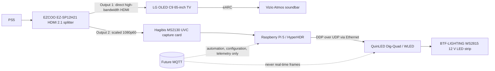

# Architecture

```mermaid
flowchart LR
  PS5[PS5] --> S[EZCOO EZ-SP12H21 HDMI 2.1 splitter]
  S -->|Output 1: direct high-bandwidth HDMI| TV[LG OLED C9 65-inch TV]
  TV -->|eARC| Soundbar[Vizio Atmos soundbar]
  S -->|Output 2: scaled 1080p60| Capture[Hagibis MS2130 UVC capture card]
  Capture --> Pi[Raspberry Pi 5 / HyperHDR]
  Pi -->|DDP over UDP via Ethernet| WLED[QuinLED Dig-Quad / WLED]
  WLED --> LEDs[BTF-LIGHTING WS2815 12 V LED strip]
  MQTT[(Future MQTT)] -. automation, configuration, telemetry only .-> Pi
  MQTT -. never real-time frames .-> WLED
```

## Data-flow boundaries

The splitter's first output is the high-bandwidth PS5-to-TV path. Aurora does
not sit inline after that output and must not compromise 4K120, VRR, HDR, eARC,
or Atmos. Only the secondary, scaled 1080p60 output is captured.

HyperHDR on the Raspberry Pi 5 is the initial capture and screen-color
extraction component. The Pi and Dig-Quad communicate over Ethernet. WLED owns
physical LED control; Project Aurora does not replace either component in this
milestone.

## Transport roles

DDP over UDP is the planned real-time frame transport because it is intended
for frequent LED-frame delivery with low overhead. MQTT is deliberately
reserved for future automation, configuration, and telemetry. MQTT must not
transport real-time LED frames.

## Future zones

The first planned zone is the rear perimeter of the 65-inch LG C9. Future
independent zones should be represented as separately named, configurable
entities with their own mapping and endpoint configuration. LED counts,
addresses, ports, and layout orientation must be measured and configured, never
embedded in code or example defaults.

## Configuration boundary

Milestone 2 supplies a validated configuration model for the planned components
only. It loads safe defaults, an explicitly selected YAML file, `AURORA_`
environment overrides, and CLI overrides without connecting to a device. The
configuration model does not establish any hardware or network integration.

## Runtime boundary (Milestone 3)

`aurora_core.config` owns loading and validates one `AuroraSettings` snapshot.
Runtime planning accepts that snapshot only and creates an immutable,
secret-free `RuntimePlan`; it neither reads files or environment variables nor
contacts devices. The plan always orders components as capture device, HyperHDR,
WLED, DDP, then MQTT. Zones and LED layout are summarized as resources, not
startable components.

Future adapters must be injected through the synchronous component contract
(`component_id`, `start`, `stop`, and `health`). The controller starts enabled
components in plan order and stops successful starts in reverse order, including
startup rollback. Lifecycle states are created, starting, running, stopping,
stopped, and failed. Health states are disabled, unknown, healthy, degraded,
and unhealthy; valid configuration begins as unknown.

Overall health is disabled with no enabled components, then prioritizes
unhealthy/failed, degraded, unknown (including missing reports), and healthy.
No automatic reload, file watching, environment rereading, polling, or adapter
implementation exists. To apply configuration changes, stop the controller and
create a new settings snapshot, plan, and controller.

## Read-only WLED boundary (Milestone 4)

The explicit `aurora hardware validate wled` operator command makes one GET
request to WLED's fixed `/json/info` endpoint, with a finite configured timeout
and a 64 KiB response limit. Its public sanitized report retains firmware
version, LED count, uptime, and current-limit observations when reported. It
does not start the runtime controller, transmit DDP, alter WLED state, or
validate HyperHDR or capture hardware. A future runtime adapter requires
separate approval.

## Read-only HyperHDR boundary (Milestone 5)

`aurora hardware validate hyperhdr` is a separate explicit operator command. It
makes exactly one HTTP GET to fixed `/json-rpc`, URL-encoding only the fixed
`{"command":"serverinfo"}` request. It has a finite timeout (default 2.0
seconds), rejects redirects, and limits responses to 256 KiB. Its sanitized
report retains successful server-information status, optional `videomodehdr`,
and selected instance, grabber, and LED-output booleans when reported; it
neither changes HyperHDR state nor contacts WLED, starts capture, sends DDP, or
starts the runtime controller.

## Capture-device boundary (Milestone 6)

The explicit capture validation command performs bounded local Linux metadata
inspection of one configured identifier. It never opens the node or issues an
ioctl, and it neither contacts HyperHDR/WLED nor starts the runtime controller.
See [capture-device validation](capture-device-validation.md).

## Query-only V4L2 capability boundary (Milestone 7)

The explicit `aurora hardware validate capture-capability` command resolves one
configured identifier, opens one V4L2 node, issues only `VIDIOC_QUERYCAP`, and
closes the descriptor. It uses node-specific `device_caps` when Linux signals
`V4L2_CAP_DEVICE_CAPS`; otherwise it uses `capabilities`. It does no frame,
format, buffer, streaming, network, or runtime operation. See
[capture capability validation](capture-capability-validation.md).

## Bounded V4L2 mode boundary (Milestone 8)

The explicit `capture-modes` command opens one configured node once, queries
capabilities, and performs only bounded V4L2 format, size, and interval
enumeration. It does not configure capture or acquire frames; runtime remains
hardware-free. See [capture mode enumeration](capture-mode-enumeration.md).

Milestone 9 adds a separate operator-only `capture-frame` boundary. It permits
capability and current-format queries plus one bounded frame acquisition on one
configured target. Read/write capture is preferred. When the device does not
support read/write I/O, the command may fall back to a bounded single-planar
MMAP path that requests driver buffers, maps and queues exactly one buffer,
starts the stream, dequeues at most one frame, and then stops, wipes, unmaps,
releases, and closes all resources. It never performs continuous capture,
transmits frame data, or retains frame content.

## Bounded DDP output boundary (Milestone 10)

`aurora hardware validate ddp-output` is a separate, explicit operator action,
not a runtime adapter. Configuration must enable DDP and provide its host, and
exactly one enabled `lighting_zones` entry must provide 1–512 LEDs. The service
constructs and validates the complete test and blackout packet plans before it
resolves the configured destination once or creates one UDP socket.

The command submits at most one static RGB(0, 0, 16) frame and then enters the
blackout phase exactly once. Blackout is attempted after socket creation even if
test submission fails. One two-second monotonic transmission/send deadline is
established before resolution, so resolution and socket creation consume the
remaining send budget and no `sendto` call is permitted after it expires. The
standard-library `getaddrinfo` call is blocking and cannot be forcibly
interrupted by this implementation; neither resolution nor total command
wall-clock duration is claimed to be capped at two seconds. If resolution
returns after the deadline, the socket is still created, no test packet is sent,
and the blackout phase is entered under the same expired deadline. There is no
retry or address fallback, at most two datagrams per frame, and at most four send
calls. Resolution accepts exactly one unique IPv4 or IPv6 unicast UDP
destination; discovery, broadcast, multicast, scanning, and mDNS browsing are
absent.

The socket is closed after blackout and no later network operation is permitted.
A blackout failure overrides test and cleanup outcomes. Successful submission of
both frames with unconfirmed socket closure is degraded; an earlier test failure
remains unhealthy even when blackout succeeds. UDP submission has no receipt
acknowledgment and makes no claim about WLED receipt, LEDs, or the complete
lighting path. Runtime and continuous DDP transmission remain unimplemented. See
[bounded DDP output validation](ddp-output-validation.md).

## Single-zone baseline proof boundary (Milestone 11)

Milestone 11 defines an operator-controlled proof and deployment runbook for the
existing single-zone architecture. It does not replace or add components to the
direct PS5-to-TV path, the secondary capture path, HyperHDR, WLED, or the one
configured lighting zone. Aurora remains outside the direct high-bandwidth path,
whose intended 4K120, VRR, HDR, eARC, and Atmos behavior must be observed
independently by the operator.

Project Aurora contributes only its existing configuration, read-only/query-only,
and bounded one-shot validation commands plus the documentation needed to record
evidence. HyperHDR continues to own capture, screen-color extraction, and the
operator-controlled live real-time color test through its supported configuration
and interface. No Project Aurora runtime adapter or continuous transmitter is
introduced.

The baseline is considered proven only when every mandatory runbook gate has
recorded operator evidence under the stated test conditions. The documentation
itself does not claim that the physical path has passed, and software cannot
verify physical LED output, direct-path video/audio properties, wiring, or
electrical safety. Multi-zone orchestration and custom runtime transmission
remain deferred to separately approved future work. See the
[single-zone baseline proof and deployment runbook](single-zone-baseline-proof.md).

## Read-only health dashboard boundary (Milestone 12)

The dashboard consumes one immutable validated `AuroraSettings` snapshot. It
reuses the existing WLED information, HyperHDR serverinfo, and non-opening V4L2
metadata validators. Its only additional device request is a fixed, bounded
WLED `GET /json/state`; it introduces no POST, DDP, capture ioctl, runtime
adapter, service operation, or power operation.

Independent collectors run concurrently, but one shared service serializes
snapshot creation and caches each result for the configured refresh interval.
Page and API requests therefore do not create overlapping hardware polls.
Collector exceptions and offline components are isolated into sanitized health
records that contain no endpoint or capture-path configuration.

Capture activity is inferred only from HyperHDR's sanitized grabber component
flag when present. The dashboard does not acquire a frame, prove frame freshness,
inspect the splitter, or claim the complete physical path is healthy. See the
[health dashboard guide](health-dashboard.md).

## Unified read-only portal boundary (Milestone 13)

Milestone 13 adds a route-aware presentation layer in front of the unchanged
Milestone 12 `HealthService`. Overview and component pages obtain one report
from that shared service and render only component-specific allowlisted fields.
No route constructs a device transport, calls a collector directly, or bypasses
the configured cache interval. Locally bundled CSS supplies responsive and
accessible presentation without a web or frontend framework, remote asset, or
browser-side device request.

The public portal accepts GET requests for native pages, its local stylesheet,
and the existing schema-version-1 health endpoint. State-changing requests to
public health routes receive method-not-allowed responses; Milestone 14's
separate login and logout boundary is described below. Unknown detail keys,
configured endpoints, capture identifiers, raw responses, exceptions,
credentials, and other installation values are not rendered. Content security,
anti-framing, no-referrer, no-sniff, and no-store response headers reinforce the
local read-only boundary without requiring TLS or breaking ordinary trusted-LAN
HTTP.

Room Map and Spatial Intelligence are descriptive preview routes only. They add
no zone model, capture analysis, AI dependency, persistence, or output path. A
future control plane must be separately authenticated, typed, bounded, audited,
and kept outside the health-snapshot service. See the
[unified portal architecture](unified-portal.md).

## Authenticated control-plane boundary (Milestone 14)

Milestone 14 adds a `ControlPlaneService` beside, not inside, the public
`HealthService`. The public portal and `GET /api/health` retain the same cached
single-flight collectors and schema-version-1 model. Authentication pages,
protected status routes, logout, and local static assets do not obtain a health
snapshot and cannot construct or invoke a hardware adapter.

Authentication configuration defaults to disabled. Disabled authentication
makes the protected boundary unavailable; it never grants access. When enabled,
credentials are verified against a bounded versioned password hash and a
thread-safe process-local service creates absolute-lifetime sessions. Cookies
contain only opaque random identifiers while the server retains identifier
digests, the bounded operator name, expiration metadata, and a per-session CSRF
token. Session and login-attempt state is memory-only and disappears on restart.

At Milestone 14, `POST /login` and CSRF-protected `POST /logout` were the only
accepted POST routes. Strict media type, length, body-size, encoding, field, and redirect
allowlists precede credential or CSRF processing. Protected HTML requests use a
login redirect, while protected API requests fail with JSON `401`. Fixed,
sanitized audit events record security outcomes without raw request, credential,
cookie, token, client, endpoint, or exception data.

Milestone 14's control capability contract reported mutations disabled and
registered no operations or executor. Non-executable metadata documented the required typed
input, explicit timeout, allowlisted adapter, audit, CSRF, and confirmation
boundaries for later separately reviewed operations. It cannot forward an
arbitrary URL, API path, JSON object, shell command, or device payload. No
device-control capability exists in Milestone 14. See the
[control-plane security guide](control-plane-security.md).

## Bounded WLED control boundary (Milestone 15)

Milestone 15 extends the protected control plane with exactly three code-owned
contracts: `wled.power_on`, `wled.power_off`, and `wled.brightness_set`.
Effective capabilities are the deterministic intersection of those contracts,
dashboard authentication, the separately enabled WLED control configuration,
and the configured operation allowlist. Existing configurations therefore stay
read-only.

The browser selects only one fixed route and route-specific form fields. It
cannot supply an operation identifier, destination, method, API path, headers,
or JSON object. Authentication and per-session CSRF validation precede strict
typed input validation. Power-off also requires fixed, separate confirmation.
The brightness model accepts only an absolute integer from 1 through the
configured maximum and never changes power implicitly.

A dedicated synchronous adapter generates one fixed-shape JSON payload and
performs exactly one POST to WLED's fixed `/json/state` resource. Redirects are
rejected, the response is bounded, the timeout is finite, and no retry or
automatic rollback occurs. The returned direct state object must contain the
requested Boolean power state or exact integer brightness before success is
verified. All failures become fixed sanitized reason codes.

A nonblocking lock permits at most one WLED mutation at a time, and a separate
bounded monotonic limiter restricts attempts without storing raw client
identifiers. Only verified success invalidates the existing `HealthService`
cache. Generation-aware invalidation itself performs no poll and preserves the
single-flight collector guarantee even when a health sweep is active. Protected
WLED presentation uses that same snapshot rather than a second read path.

Audit events contain only a fixed event, fixed reason, schema version, and
allowlisted operation identifier. No brightness, state, endpoint, body,
response, credential, cookie, session, CSRF token, client identifier, or raw
exception is recorded. The public portal and `GET /api/health` remain read-only
and retain health schema version 1. See the
[bounded WLED control guide](wled-controls.md).

## Bounded HyperHDR control boundary (Milestone 16)

Milestone 16 adds a second, independent mutation service beside the WLED
service. Its exact registry contains video-grabber enable/disable and LED-output
enable/disable. Code maps those operations only to `VIDEOGRABBER` or
`LEDDEVICE` and a fixed Boolean. Authentication, enabled and validated HyperHDR
configuration, the separate control switch, the configured allowlist, and the
code registry must all agree before a capability exists.

The dedicated mutation adapter performs exactly one POST to `/json-rpc` with a
code-generated `componentstate` object. It rejects redirects, bounds timeout and
response size, and requires a top-level Boolean `success: true` acknowledgement
whose optional command matches. It does not reuse or generalize the existing
read-only transport.

After acknowledgement, the adapter invokes the existing fixed `serverinfo` GET
transport and parser exactly once. `VIDEOGRABBER` is verified against
`grabber_active`; `LEDDEVICE` is verified against `led_output_active`. Missing,
ambiguous, opposite, malformed, or unavailable verification becomes an
unverified warning because the change may already have applied. No retry,
rollback, response-provided URL, or second mutation occurs.

All HyperHDR mutations share one nonblocking process-local lock and use their
own bounded monotonic limiter. Only verified success invalidates the shared
health cache, without polling. The protected page reads that shared snapshot;
the public portal and `GET /api/health` remain read-only and retain schema
version 1. Audit fields remain limited to fixed event/reason values and one
allowlisted operation ID. See the
[bounded HyperHDR control guide](hyperhdr-controls.md).

## Local configuration-profile boundary (Milestone 17)

Milestone 17 adds a CLI-only service beside the ordinary configuration loader.
It manages only an explicitly supplied active Aurora YAML file, profile
directory, and backup directory. It adds no dashboard route, health-cache
behavior, device adapter, service action, network operation, file search, or
runtime reload.

A strict logical identifier maps in code to one complete
`<identifier>.yaml` document. Profiles are replacements, not patches: there is
no fragment, inheritance, include, template, interpolation, chain, remote
source, or merge with active YAML. Raw validation rejects malformed UTF-8,
multiple documents, non-mapping roots, duplicate keys, aliases, unsupported
tags, invalid Aurora settings, and identifier mismatch. Effective validation
then uses the existing environment-aware `load_settings()` path. Precedence
remains CLI, process environment, YAML, then defaults.

The dedicated filesystem boundary enforces no-follow opens, restrictive modes,
effective-user ownership, single-link managed files, bounded reads and
enumeration, descriptor metadata rechecks, and no symlink path components.
Planning reports only sorted key paths, change types, byte identity, and
SHA-256 digests.

Apply and rollback share one nonblocking advisory lock in the backup directory.
Each mutation creates an exact previous-byte YAML backup and strict bounded
manifest before a same-directory temporary file is durably published with
atomic replacement. Published bytes and hash are reopened and raw/effectively
revalidated. A post-publication failure triggers one atomic restoration and
verification of exact pre-operation bytes; restoration failure has a distinct
high-severity exit and preserves evidence. Rollback first backs up the current
active YAML, making rollback itself reversible.

Success changes only the on-disk YAML layer. It does not update a running
settings snapshot, restart a service, edit environment state, back up
WLED/HyperHDR configuration, or restore device state. See the
[configuration-profile guide](configuration-profiles.md).

## Persistent health-history foundation (Milestone 18 in progress)

The first four Milestone 18 production slices supply an isolated
`aurora_core.health_history` package. Its stricter code-owned projection accepts
only complete `HealthReport` schema version 1 snapshots and retains status,
timestamps, bounded latency, and fixed reasons. It cannot copy arbitrary detail
fields, messages, configuration, endpoints, identifiers, responses, request
data, credentials, or exceptions. Production/reference parity tests bind its
independent reason registry to the accepted preimplementation model.

The package defines exact SQLite schema version 1 under application identity
`0x41555248`. New database creation is exclusive and separate from
existing-database opening; existing files are opened with URI `mode=rw` and
fail closed on filesystem, identity, pragma, schema, or bounded integrity
verification failures. The standard library opens SQLite files by pathname,
not the already inspected descriptor, so the accepted owned mode-`0700`
directory boundary remains required and no internal `O_NOFOLLOW` claim is made.

Before any deployment database exists, schema version 1 is refined with one
singleton accepted-observation checkpoint, an independent monotonic scheduler
sequence, a fixed 64-entry replay ledger, and no singular current-alert
reference. The narrow store ingestion method revalidates one immutable
projection, rejects replay, stale ordering, and conflicts before mutation, and executes one fixed
`BEGIN IMMEDIATE` transaction. It updates six evaluator scopes, optionally
stores a transition, marker, or 15-minute heartbeat with four component rows,
and applies bounded health, sampling-gap, and automatic alert transitions.
Lifecycle evidence promotes ordinary heartbeat compaction to transition;
retention-cleared evaluator references establish the next ordinary transition
baseline. Exact active, terminal, and archival indexes bound alert lookup.
Degraded and unavailable alerts remain distinct records for the same scope.
Filesystem identity is checked before and after the transaction; SQLite trust
loss closes the store, while busy/locked remains a non-trust failure. Results
are fixed and sanitized with no retry or queue.

The third slice adds only narrow read methods on the verified store. Samples
use `(observed_at_utc_us DESC, id DESC)`, alerts use
`(opened_at_utc_us DESC, id DESC)`, and one alert's events use
`(event_at_utc_us ASC, id ASC)`. Immutable cursors contain only those two fixed
bounded integers. Default pages are 50 records and hard maximum pages are 100;
there is no offset, unlimited mode, caller-supplied SQL, ordering, predicate,
or column. The only filters are exact overall health status for samples and
exact lifecycle for alerts. Every returned history row is reconstructed with
exactly four ordered components and its internal canonical digest is
revalidated. Alert and event lifecycle fields and non-null retained sample
references are likewise validated before return. Main-file and sidecar identity
checks surround each read-only transaction, malformed state closes the store,
and full-table snapshot tests prove reads do not mutate schema-version-1 rows.
Two minimal indexes serve global and lifecycle-filtered alert ordering; existing
sample and event indexes serve the other keyset queries.

The fourth slice corrects pre-deployment schema version 1 so new databases set
and verify `auto_vacuum=INCREMENTAL` before application tables are created.
Opening never converts or repairs another auto-vacuum mode. Three child-key
indexes bound nullable sample-reference updates on alerts and events, and one
partial index orders archived alerts by recovered time and ID. Because no
production history database exists, these remain direct schema-version-1
refinements with no migration.

Two additional narrow store methods remain direct-only. `cleanup_retention`
uses a strict default 30-day cutoff with a 1–365-day argument bound, one
immediate transaction, deterministic health-first tie handling, and one total
500-row budget across explicit sample, archived-event, and archived-parent
deletions. Events are deleted in bounded order before an eligible parent, and
foreign-key cascade/SET-NULL behavior changes only documented sample history
and references. `incremental_vacuum` reads the freelist and makes at most one
fixed 128-page request, consumes its bounded cursor to statement completion,
and verifies that the freelist falls by no more than 128 pages. Both use
one-second monotonic/progress bounds, including explicit Python-loop and
post-commit checks, and pre/post main-file and sidecar identity checks. A
post-commit timeout may leave the selected cleanup durable and therefore never
claims rollback. There is no retry, full vacuum, WAL checkpoint, or drain loop.

No current runtime entry point imports this package. There is no configuration,
deployment database creation, scheduler or maintenance cadence, route,
acknowledgment, WAL checkpoint, capacity integration, or device/service/network
behavior. Existing portal routes and public `GET /api/health` schema version 1
remain independent and unchanged. The next slices are scheduler/storage-envelope
integration, separately authenticated acknowledgment, and separately reviewed
presentation/runtime integration. See the detailed [health-history and alerting
design](health-history-alerting.md).
